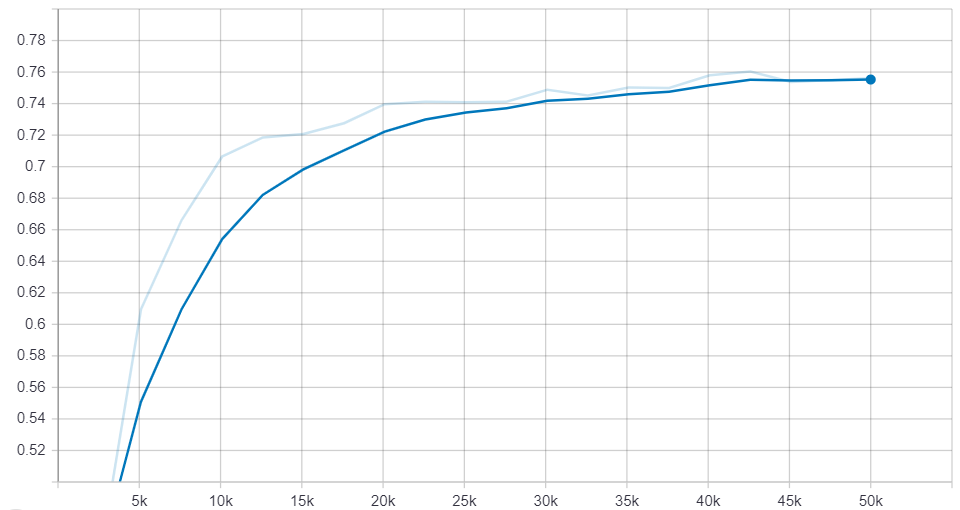
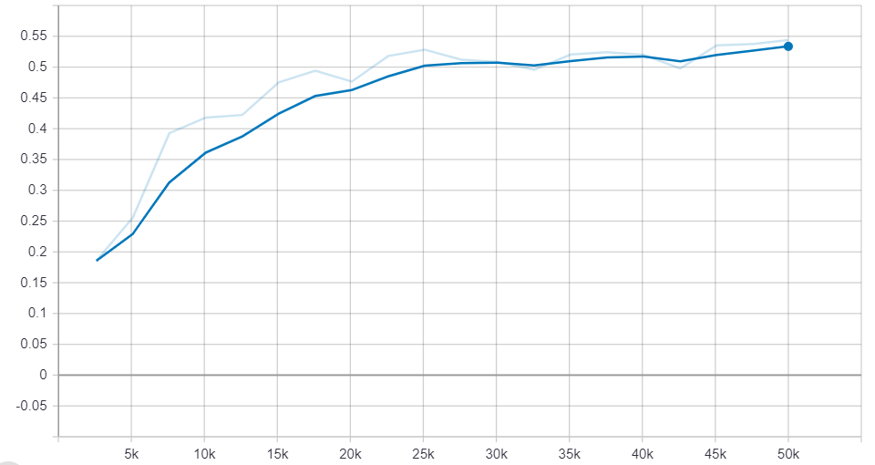
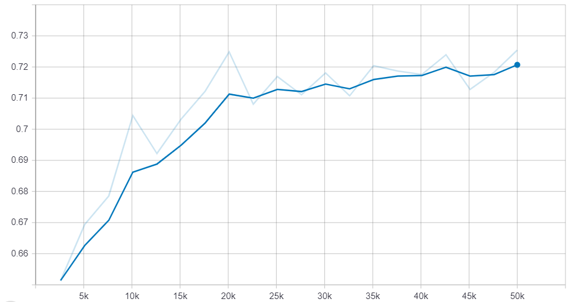
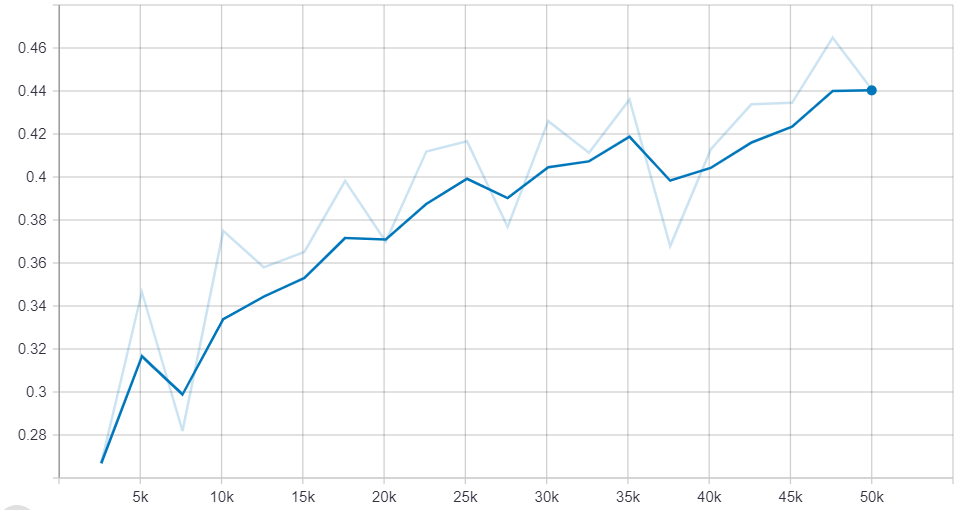
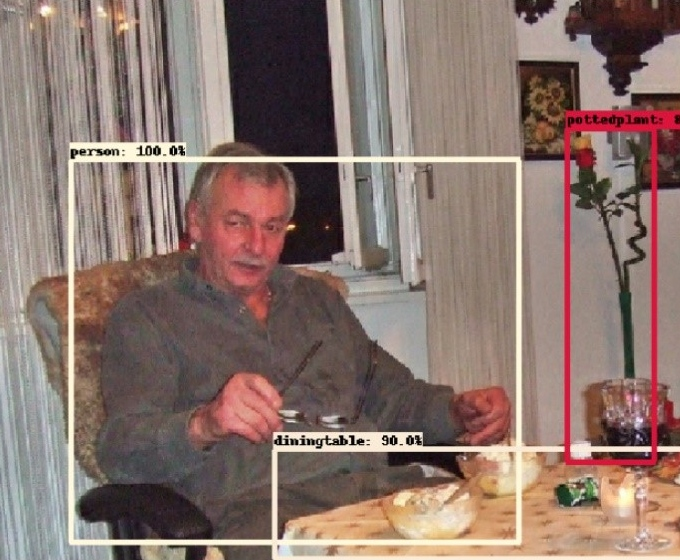
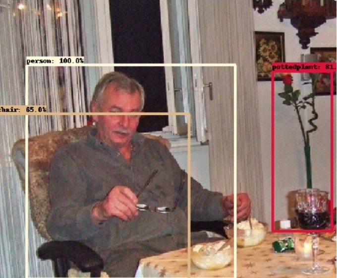
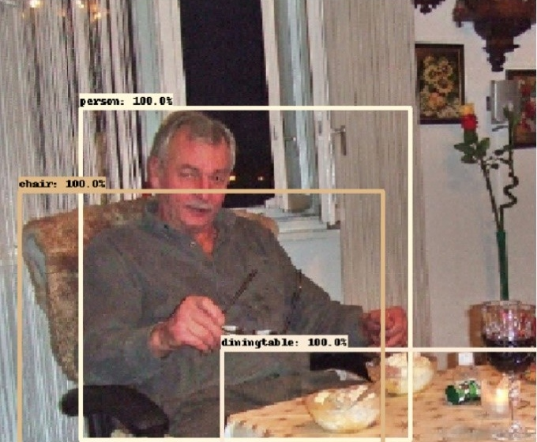
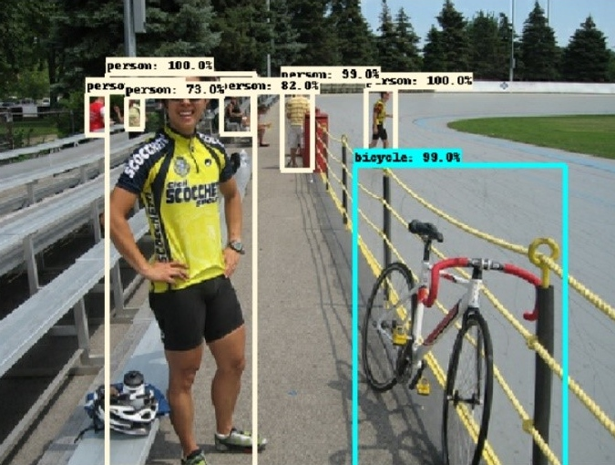
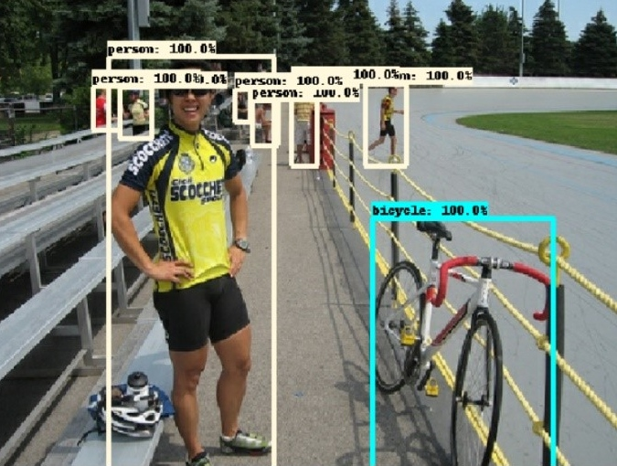

## Overview
In this project, two models (Faster R-CNN and R-FCN) in TensorFlow model zoo were trained on Pascal VOC dataset. Steps and detailed descriptions on steps can be found in the files above.

## Model Architectures
## Model Performances
  |  
:-------------------------:|:-------------------------:
Faster-RCNN (IOU&ge;50) | Faster-RCNN (IOU&ge;75)

  |  
:-------------------------:|:-------------------------:
R-FCN (IOU&ge;50) | R-FCN (IOU&ge;75)

## Some Results
|  |  |  |
| :---:       |    :----:   |          :---: |
| Faster-RCNN      | R-FCN       | Ground-truth boxes   |

|  |  |  |
| :---:       |    :----:   |          :---: |
| Faster-RCNN      | R-FCN       | Ground-truth boxes   |
